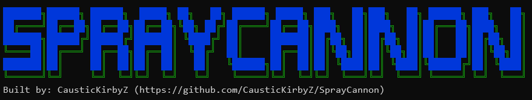

 
 


# **Why**
I got sick and tired of having to remember and manually spray a password every 30-60 min for a userlist and managing a large list with what passwords had been sprayed for what user was the worst. Also adding to a userlist added additional problems with either starting over or leaving out missed passwords for new accounts. Additionally many spraying tools only existed for certain endpoints ie just an o365 spray tool or just an exchange spray tool. I wanted a standard framework that could do any spraying i needed with all the features i wanted. So i created....


<br>
 


### Theres a [wiki](https://github.com/CausticKirbyZ/SprayCannon/wiki) now _(mostly built now i think)_.

# **SprayCannon**
A fast multithreaded password spray tool designed to simplify and automate many password spraying problems i faced.
## **Features**
* Database to keep track of what has been sprayed/valid finds (Sqlite3)
  * This prevents previous combos from being sprayed!! So if you add a username to your list you can just rerun the same command and it will ignore previously sprayed combos
* Supports username,password (as single inputs and files )
* Jitter between individual authenticaion requests
* Delay between passwords
* MFA detection ( on a per module basis )
* Lockout detection (on a per module basis )
* Webhook support (autodetects Teams, Discord, Slack, and Google Chat URLS via domain name)
* Multithreaded
* For full list of changes and features added/removed. see the [ReleaseNotes](https://github.com/CausticKirbyZ/SprayCannon/blob/main/ReleaseNotes.md)

# **SPDB** 
An nice interface for the backend database.
## **Features** 
* console application 
* tab completion 
* suggestions 
* exporting info to csv file 
* search capabilities

<br>
 

**Note:** The the demo above uses the testing spraytype for demonstration purposes. This doesnt make any network connections.

## **Current supported spray types**
fully implemented means that the module works as designed. some protocols may not support mfa detection. others i have not had a chance to compare the "valid" check for one with MFA enabled ( ex. sonicall virtualoffice )
|Type|MFA support| Lockout Detection | Fully implemented |
|----|-----------|-------------------|-------------------|
ExchangeEAS|no  |  no               | yes                
ExchangeOWA|no  |  no               | yes (could be a little more refined but fully working)
adfs_forms |YES(msft azure mfa ) |  no               | yes
o365_adfs_forms | not yet |  no               | not validated 
SonicwallVirtualOffice|no  |  no    | yes (no mfa though) (validation not confirmed)
Sonicwall(the digest one) | no | no | yes(validation not confirmed)
O365|YES|YES|yes
SSLVPN Cisco|no|no|yes ~~( i converted some code from a previous spraying ruby script i wrote that worked. but havent had a chance to test this one)~~ confirmed with group= --domain flag.
VPN Fortinet|no|no|kinda(use at own risk)(validataion not confirmed)
Spiceworks|no|no|no(no mfa/lockout though)(validataion not confirmed)
InfinateCampus|no|no|yes
Global Protect | no|no|not fully tested 
ESXI (root web) | no | no (default is 10 be carefull) | yes - tested with esxi 6.5,7.0
VmWare Horizon (Domain Joined Web prompt) | no | no | yes 
Okta | not yet  | no  | Yes (may try to add mfa detection later)
Egnyte | no  | no  | not validated
Citrix | no  | no  | not validated


```
Examples:
./spraycannon -s msol -u myemail@domain.com -p password123
./spraycannon -s adfs_forms -u usernames.txt -p passwords.txt
./spraycannon -s msol --user-pass-format upffile.txt
./spraycannon -s ExchageOWA -u myemail@domain.com --user-as-password --target "https://adfs.mydomain.com"

Examples:
./spraycannon -s msol -u myemail@domain.com -p password123
./spraycannon -s adfs_forms -u usernames.txt -p passwords.txt
./spraycannon -s msol --user-as-password --user-pass-format upffile.txt
./spraycannon -s msol -u myemail@domain.com --user-as-password

Global options:
    -s, --spray-type=[spraytype]     Set spray type. use --list-spraytypes to get current list
    -t, --target=[ip/hostname]       Target to spray ( could also be a fireprox address )
    -u, --username=[name]            Comma seperated usernames or filename of usernames to spray (one per line)
    -p, --password=[password]        Password or file of passwords to spray. Whitespace will be trimmed off the ends
    -d, --delay=[time]               Time in seconds to delay between password attempts
    -j, --jitter=[time]              Time in milliseconds to delay between individual account attempts. default is 1000.
    --domain=[domain]                Sets the domain for options that require domain specification.
    -h, --help                       Print Help menu
    --version                        Print current version
    -v, --verbose                    Print verbose information

Additional Options:
    --threads=[count]                Use worker threads to drasticly speed things up!(default is 1)
    --nodb                           does not use the database
    --force                          Forces the spray to occur despite if it has been sprayed before or if it was previously marked invalid. This still logs to the database.
    --user-as-password               Sets the user and password to the same string
    --user-pass-format=[filename]    Supplied file in 'user:password' format. If a password has a : in it, it wont break. everything after the first : is used as the password
    --webhook=[url]                  Will send a webhook if valid credential is found!! (autodetects Teams, Discord, Slack, and Google Chat URLS)
    --webhookcard=[string]           The 'card' template used to send to the specified webhook. For use only with custom webhooks(for now)
    --strip-user-string=[stiped_string]
                                     Will strip the entered string from the end of the username. Ideally used with --user-as-password.  ex: --strip-user-string '@domain.com' = user@domain.com => user
    --strip-pass-string=[stiped_string]
                                     Will strip the entered string from the end of the username. Ideally used with --user-as-password.  ex: --strip-pass-string '@domain.com' = user@domain.com => user
    --useragent=[agentstring]        Use a custom useragent string, or a file containing useragents(will chose randomly from them).
    --list-spraytypes                List the available spraytypes.
    --disable-color                  Disables color outputs entirely
```


## **Use**

### Download from [releases](https://github.com/CausticKirbyZ/SprayCannon/releases).
or 

## Compile yourself 
either use the make file 
```bash
make all        # compiles spraycannon and spdb 
make install    # installs the tools
```
### Compile the manual way 
```bash
shards install 
crystal build -p src/spraycannon.cr 
crystal build -p src/spdb.cr 
```
You can also use:
```bash
shards install 
crystal build -p --no-debug --release src/spraycannon.cr 
crystal build -p --no-debug --release src/spdb.cr 
```
Which will take longer but will be more optimized (not that you need it) it also may not give you help if something breaks.... your choice

### **Examples:**
```
./spraycannon -s ExchangeEAS -u users.txt -p passwords.txt
./spraycannon -s msol -u "user1@example.com" -p passwords.txt
./spraycannon -s vpncisco -u users.txt -p "Password123" --webhook "https://teamswebhook.com/asdfasdfasdf"
./spraycannon -s msol -u emails.txt -p "Password123" --jitter 500 --dealy 3600  --target "https://aws.fireprox.instance/fireprox"
```


## TODO
* ~~multithread things ( templates started )~~
* add a spraygroup feature - so that you can spray multiple back to back but then delay. this may be usefull for some lockout policies. 
* ~~go public~~
* ~~dd wiki~~ its there. will be constantly adding to it 
* ~~maybe update the way some of the modules are called (thinking ./spraycannon \<type\> [arguments] ex. spraycannon vpncisco -u users.txt -p "Password123" )~~ just going to stick to the -s flag. dont fix whats not broken.
* docker file?
* ~~make install feature~~
* ~~pipeline something so that i can build/release on multiple platforms at a time~~
* Add various webhooks support. ~~teams~~,~~slack~~, ~~google chat~~( need feature requests here for what people use )
* Email support? like webhooks but email? could be usefull for sending emails to phone numbers for sms notifications.... probably a dumb idea
* Implement a yml file for configuration defaults. That might be easiest for things like webhooks, target substitutions... etc that way no cluttered cli 
* Add better support for fireprox or other web proxies like that - currently fireprox can be used as the target and does work. Proxychains works well so that may be what i stick with. 
* Update spdb to include tab completion and better dialog menus
* Make a wiki.... this file it getting a bit big and harder to navigate


## **Contributing**
* Fork the project and submit a request with your feature/fix 
* Submit a feature request through github(look at the wiki/todo list first your idea might already be there or answered)
* If you have a new spray type you want submit a feature request or give me the web request sequence (burp files are super nice). NOTE if its not public/you cant prove you own something i wont test password spraying unless i can spin it up in my lab. If you send me a burp sample.... please consider OPSEC.  
* For new spraytypes there is a template.cr file in src/spray_tyes that should be easy/convienient to use to implement new auth types


# **spdb**
spdb is a simple applicaion to interact with the backend db for SprayCannon. there is now a timestamp for each password spray item. so it is possible to go back and see exactly what time a specific user attempt was sprayed.

interactive commands: 
* usernames - show usernames in the database
* passwords - show what passwords have been sprayed 
* sprayed - shows all username/password combination that have been sprayed
* vaid - shows all username/password combinations that are valid
* export \<tablename\> - exports the specified tablename to a csv file in the local directory 
* search \<search string\> 
* valid \<search string\>
* help 

spdb now supports tabcompletion and syntax suggestion! 


# ~~**spdb2**~~
~~spdb2 is the new updated version of spdb. it now features a tab completsion and help menu scrolling option while naviating.~~
~~features are expiramental at this point. but should work as advertized.~~ this is out of date now and merged to the main spdb 


# **On the shoulders of Giants**
### Some of the available spraytypes/options would not have been possible if not for the previous work done by: 
* @dafthack - [mailsniper](https://github.com/dafthack/MailSniper)/[MSOLSpray](https://github.com/dafthack/MSOLSpray)
* @byt3bl33d3r - [CrackMapExec](https://github.com/byt3bl33d3r/CrackMapExec)'s cmedb (inspiration for spdb)
* ustayready - [fireprox](https://github.com/ustayready/fireprox)

# Thank you all for your inspiration and contributions to the community!!!  

## Other Thanks 
* To the individual who helped troubleshoot okta. (you know who you are)


# **Crystal Install help** 
Spraycannon is written in [crystal-lang]("https://crystal-lang.org"). A language similar to ruby in syntax but produces a  compiled binary, is extremely fast, and is easy to work with. Installing can be done as below. if you dont trust these commands... go here: https://crystal-lang.org/install/

---
**Arch** based linux distros  
```
sudo pacman -S crystal shards 
```

**Debian/RedHat** based linux distros(**Kali** too)
```
curl -fsSL https://crystal-lang.org/install.sh | sudo bash
```

**Windows** (Crystal not fully supported on windows *yet*) there are several options:
* There is prerelease crystal compiler for windows available. 
* Use wsl (this is what i use 80% of the time and it works really well)
* use a linux vm

\* **Note:** ~~Crystal doesnt have an official windows compiler release yet.~~ It does now! Not sure if i want to support windows yet but if someone wants it submit an issue and ill see if i can get it working. If a bug is found please create a bug report and i will try to address it. 

**MacOS**(homebrew):
```
brew update
brew install crystal
```

\* **Note:** I dont have a mac so i cant quite support MacOS. If a bug is found please create a bug report and i will try to fix. 


* [ExchangeEAS] (https://github.com/CausticKirbyZ/SprayCannon/wiki/SprayType_ExchangeEAS)
* [ExchangeOWA] (https://github.com/CausticKirbyZ/SprayCannon/wiki/SprayType_ExchangeOWA)
* [cisco_vpn] (https://github.com/CausticKirbyZ/SprayCannon/wiki/SprayType_cisco_vpn)
* [ADFS_forms] (https://github.com/CausticKirbyZ/SprayCannon/wiki/SprayType_ADFS_forms)
* [vpn_sonicwall_virtualoffice] (https://github.com/CausticKirbyZ/SprayCannon/wiki/SprayType_vpn_sonicwall_virtualoffice)
* [vpn_sonicwall_virtualoffice_5x] (https://github.com/CausticKirbyZ/SprayCannon/wiki/SprayType_vpn_sonicwall_virtualoffice_5x)
* [vpn_sonicwall_digest] (https://github.com/CausticKirbyZ/SprayCannon/wiki/SprayType_vpn_sonicwall_digest)
* [vpn_fortinet] (https://github.com/CausticKirbyZ/SprayCannon/wiki/SprayType_vpn_fortinet)
* [spiceworks] (https://github.com/CausticKirbyZ/SprayCannon/wiki/SprayType_spiceworks)
* [InfinateCampus] (https://github.com/CausticKirbyZ/SprayCannon/wiki/SprayType_InfinateCampus)
* [global_protect] (https://github.com/CausticKirbyZ/SprayCannon/wiki/SprayType_global_protect)
* [ESXI_web] (https://github.com/CausticKirbyZ/SprayCannon/wiki/SprayType_ESXI_web)
* [VMWare_Horizon] (https://github.com/CausticKirbyZ/SprayCannon/wiki/SprayType_VMWare_Horizon)